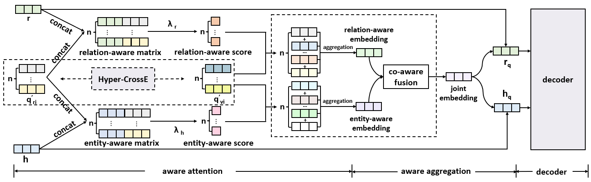

<h1 align="center">
  HIAE
</h1>
<h4 align="center">HIAE: Hyper-Relational Interaction Aware Embedding for Link Prediction</h4>
<h2 align="center">
  Overview of HIAE
  
</h2>

### Dependencies

- PyTorch 1.x and Python 3.x.

### Dataset:

- We use jf17k,  wikipeople, jf17k_clean, wikipeople_clean, and wd50k datasets for evaluation. 

### Training model from scratch:

- To start training **HIAE** run:

  ```shell
  # jf17k
  python run.py --data jf17k --gpu 0 --max_quals 8
  
  # wikipeople
  python run.py --data wikipeople --gpu 0 --max_quals 14
  
  # jf17k_clean
  python run.py --data jf17k_clean --gpu 0 --max_quals 8
  
  # wikipeople_clean
  python run.py --data wikipeople --gpu 0 --max_quals 10
  
  # wd50k
  python run.py --data wd50k --gpu 0 --max_quals 12
  
### Acknowledgement

- Parts of our codes come from [StarE](https://github.com/migalkin/StarE), [InteractE](https://github.com/malllabiisc/InteractE), and [HINGE](https://github.com/eXascaleInfolab/HINGE_code). Thanks for their contributions.


